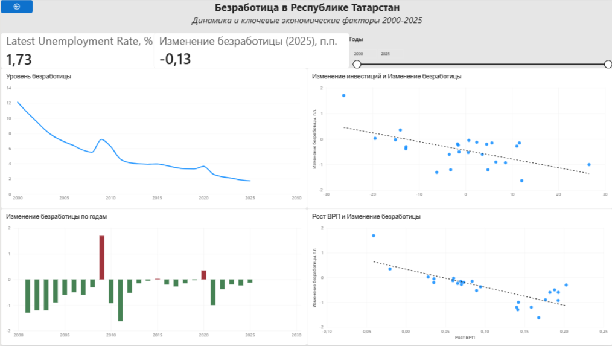

[English](README.md) | **Русский**
# Анализ безработицы в Республике Татарстан

Аналитический проект, посвящённый исследованию динамики безработицы и её связи с ключевыми макроэкономическими показателями Республики Татарстан за период с 2000 по 2025 год.

Проект объединяет подготовку и исследовательский анализ данных в Python, аналитические запросы в PostgreSQL, байесовское регрессионное моделирование, сценарный анализ и интерактивный дашборд в Power BI.

## Цель проекта

Цель проекта — исследовать, как изменения ключевых экономических показателей связаны с изменением уровня безработицы в Республике Татарстан.

Основное внимание уделяется:

- динамике инвестиций;
- росту ВРП;
- динамике безработицы во времени;
- экономическим условиям, сопровождавшим рост и снижение безработицы.

Проект также демонстрирует полный аналитический процесс: от подготовки исходных данных до SQL-анализа, статистического моделирования и визуализации результатов.

## Используемые технологии

- **Python:** pandas, NumPy, Matplotlib, Seaborn
- **Статистическое моделирование:** PyMC, ArviZ
- **База данных:** PostgreSQL
- **SQL:** проверка качества данных, аналитические запросы, CTE, оконные функции, условная агрегация, аналитические представления
- **BI и визуализация:** Power BI
- **Среда разработки:** Jupyter Notebook, VS Code, pgAdmin

## Аналитический процесс

Проект реализует полный цикл анализа данных:

`Исходные данные Excel` -> `Подготовка данных в Python` -> `EDA` -> `PostgreSQL` -> `SQL-слой` -> `Байесовское моделирование` -> `Сценарный анализ` -> `Power BI`

### Этапы работы

1. Исходные квартальные экономические данные загружаются и очищаются в Python.
2. Квартальные наблюдения агрегируются до годового уровня.
3. Рассчитываются аналитические признаки: первые разности и логарифмические темпы роста.
4. Проводится исследовательский анализ данных для изучения динамики и взаимосвязей экономических показателей.
5. Обработанный датасет загружается в PostgreSQL.
6. SQL используется для проверки качества данных, исторического анализа, оконных расчётов и создания аналитического представления.
7. Байесовская линейная регрессия используется для оценки статистических связей между изменением безработицы, динамикой инвестиций и ростом ВРП.
8. Проводится диагностика модели и анализ остатков.
9. С помощью модели рассматриваются иллюстративные экономические сценарии.
10. Аналитическое представление PostgreSQL подключается к Power BI для создания интерактивного дашборда.

## Структура проекта

```text
tatarstan-unemployment-analysis/
│
├── data/
│   ├── raw/
│   │   └── datanew.xlsx
│   └── processed/
│       └── tatarstan_economic_data_clean.csv
│
├── notebooks/
│   ├── 01_data_preparation.ipynb
│   ├── 02_eda.ipynb
│   ├── 03_bayesian_model.ipynb
│   ├── 04_model_validation.ipynb
│   └── 05_scenario_forecast.ipynb
│
├── sql/
│   ├── 01_create_tables.sql
│   ├── 02_data_quality.sql
│   ├── 03_analytical_queries.sql
│   └── 04_analytical_dataset.sql
│
├── dashboard/
│   ├── tatarstan_unemployment_dashboard.pbix
│   └── dashboard_preview.png
│
├── reports/
├── README.md
├── README_RU.md
└── requirements.txt
```

## Основные результаты

### Динамика безработицы

Уровень безработицы в Республике Татарстан демонстрирует выраженный долгосрочный нисходящий тренд: с **12,1% в 2000 году до 1,73% в 2025 году**.

Несмотря на общий тренд на снижение, в отдельные периоды наблюдался временный рост безработицы. Наиболее заметные увеличения произошли в **2009** и **2020** годах и совпали с ухудшением как инвестиционной динамики, так и динамики ВРП.

### Связь с экономическими показателями

Анализ годовых изменений показал:

- корреляция между изменением безработицы и динамикой инвестиций составляет около **−0,60**;
- корреляция между изменением безработицы и ростом ВРП составляет около **−0,77**;
- рост заработной платы и цен на жильё показал более слабую связь с годовыми изменениями безработицы.

Таким образом, более слабая инвестиционная динамика и более низкий рост ВРП в исследуемых данных связаны с увеличением безработицы.
Интерпретировать как **статистические связи, а не как доказательство причинно-следственных отношений**.

## Байесовская регрессионная модель

Для оценки связи между годовыми изменениями безработицы и выбранными макроэкономическими показателями использовалась байесовская линейная регрессия.

### Целевая переменная

- годовое изменение уровня безработицы (`unemployment_diff`)

### Предикторы

- годовое изменение индекса инвестиций (`investment_diff`)
- логарифмический рост ВРП (`grp_log_growth`)

Перед оцениванием модели предикторы были стандартизированы.

Модель оценивалась в **PyMC** с использованием алгоритма **NUTS (No-U-Turn Sampler)**.

### Апостериорные оценки

| Параметр | Среднее | SD | 94% HDI |
|---|---:|---:|---:|
| Intercept | -0.411 | 0.082 | [-0.563, -0.259] |
| Изменение инвестиций | -0.216 | 0.093 | [-0.397, -0.045] |
| Рост ВРП | -0.411 | 0.094 | [-0.582, -0.232] |
| Sigma | 0.406 | 0.067 | [0.291, 0.528] |

Оба выбранных предиктора имеют отрицательные апостериорные коэффициенты. В рамках исследуемых исторических данных более сильная инвестиционная динамика и более высокий рост ВРП связаны с более низкими годовыми изменениями безработицы.

Значения **R-hat ≈ 1.00** и высокие значения эффективного размера выборки указывают на удовлетворительную сходимость MCMC.

## Проверка модели

Для оценки качества модели и поведения остатков использовались несколько диагностик.

- **In-sample MAE:** 0.287 п.п.
- **In-sample RMSE:** 0.360 п.п.
- **Ljung-Box test (lag 5):** p-value = 0.170

Тест Ljung–Box не выявил статистически значимых свидетельств автокорреляции остатков на проверяемых лагах.

MAE и RMSE характеризуют **качество подгонки модели на использованных данных** и не являются оценкой качества прогноза на новых данных.

## Сценарный анализ

Для иллюстративного what-if анализа были рассмотрены три гипотетических экономических сценария:

| Сценарий | Изменение инвестиций | Логарифмический рост ВРП |
|---|---:|---:|
| Базовый | 0.0 | 0.08 |
| Оптимистичный | +10.0 | 0.12 |
| Стрессовый | -10.0 | 0.00 |

Полученные оценки годового изменения безработицы:

| Сценарий | Оценка изменения безработицы |
|---|---:|
| Базовый | -0.286 п.п. |
| Оптимистичный | -0.710 п.п. |
| Стрессовый | +0.374 п.п. |

При оптимистичном сценарии более сильная инвестиционная динамика и рост ВРП связаны с более выраженным снижением безработицы.

В стрессовом сценарии более слабые экономические условия связаны с увеличением безработицы.

Сценарии являются **иллюстративными what-if симуляциями, а не прогнозами фактической экономической ситуации**.

## SQL-анализ

Обработанный годовой датасет был загружен в **PostgreSQL** для создания отдельного аналитического слоя.

SQL использовался для:

- проверки качества данных и пропущенных значений;
- анализа годовой динамики экономических показателей;
- сравнения текущих значений с предыдущими годами с помощью оконных функций;
- классификации экономических условий через `CASE`;
- определения периодов с наиболее сильным ростом безработицы;
- создания аналитического представления для Power BI.

Финальное представление `unemployment_analytics` объединяет основные экономические показатели с рассчитанными признаками и категориальными индикаторами трендов.

SQL-анализ выделил **2009 и 2020 годы** как периоды наиболее сильного роста безработицы. В обоих случаях динамика инвестиций и рост ВРП были отрицательными.

## Power BI Dashboard

Интерактивный дашборд Power BI построен на основе аналитического представления PostgreSQL.

Дашборд включает:

- KPI текущего уровня безработицы и его годового изменения;
- динамику безработицы с 2000 по 2025 год;
- годовые изменения безработицы;
- связь инвестиционной динамики с изменением безработицы;
- связь роста ВРП с изменением безработицы;
- интерактивный фильтр по годам.

### Предпросмотр дашборда



## Выводы

Анализ показал устойчивое долгосрочное снижение безработицы в Республике Татарстан и отрицательную статистическую связь её годовых изменений с динамикой инвестиций и ростом ВРП.

Наиболее сильная связь среди выбранных предикторов наблюдалась между изменением безработицы и ростом ВРП.

Проект демонстрирует полный аналитический процесс, объединяющий **Python, PostgreSQL, SQL, статистическое моделирование и Power BI**.

## Ограничения

- Годовой датасет содержит только 26 наблюдений (2000–2025), что ограничивает статистические возможности анализа.
- Используются наблюдательные макроэкономические данные, поэтому результаты не позволяют устанавливать причинно-следственные связи.
- На экономические показатели могут одновременно влиять общие временные тренды и внешние экономические шоки.
- Сценарный анализ основан на гипотетических предположениях и не является официальным экономическим прогнозом.
- Данные о численности населения трудоспособного возраста отсутствуют за последние два года и не были искусственно восстановлены.

## Как запустить проект

### 1. Клонировать репозиторий

```bash
git clone <repository-url>
cd tatarstan-unemployment-analysis
```

### 2. Установить зависимости

```bash
pip install -r requirements.txt
```

### 3. Запустить Jupyter notebooks

Ноутбуки рекомендуется выполнять последовательно:

```text
01_data_preparation.ipynb
02_eda.ipynb
03_bayesian_model.ipynb
04_model_validation.ipynb
05_scenario_forecast.ipynb
```

### 4. PostgreSQL

Создайте базу данных PostgreSQL и выполните SQL-скрипты в соответствующем порядке.

После создания таблицы `economic_indicators` импортируйте:

```text
data/processed/tatarstan_economic_data_clean.csv
```

### 5. Power BI

Файл дашборда находится в:

```text
dashboard/tatarstan_unemployment_dashboard.pbix
```
## Автор

**Regina Abdulmazitova**

Выпускница направления «Математика и компьютерные науки»  
Data Analytics Portfolio Project

**Инструменты:** Python · PostgreSQL · SQL · PyMC · Power BI